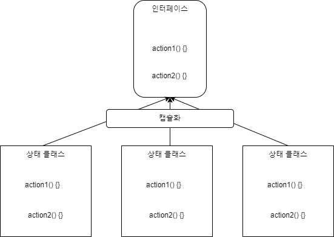

State Pattern
================

### 설명
객체 내부 상태가 변결될 때 해당 **객체가 행동을 변경할 수 있도록** 하는 행동 디자인 패턴.
즉 객체가 특정 상태에 따라 행위를 달리하는 상황에서, 자신이 직접 상태를 체크하여 상태에 따른 행위를 호출하지 않고,
***상태를 객체화 하여 상태가 행동을 할수 있도록 위임***하는 패턴

객체의 특정 상태를 클래스로 선언, 각 클래스에서는 해당 상태에서 할수 있는 행위들을 메서드로 정의.
이러한 각 상태클래스를 인터페이스로 캡슐화 하여  클라이언트에서 인터페이스 호출하는 방식으로 동작.

> **주로 코드 내의 조건문을 대체하는 목적으로 사용!**



### 특징

- 상태 페턴은 현재 상태에 따라 다르게 행동하는 객체가 있을때, 상태들의 수가 많을 때 그리고 상태별 코드가 자주 변경될 때 사용하는것이 좋다.
  - 새로운 상태 추가나 기존 상태들의 독립적 변경을 가능하도록 수정하여 유지보수 비용을 절감하기 위해, 모든 상태별 코드를 서로 다른 클래스로 개별적으로 관리하는것을 추천. 


- 클래스 필드들의 현재 값들에 따라 클래스의 행동하는 방식이 분기하여 처리되는 거대한 조건문들로 코드가 복잡할 때 사용
  - 상태 패턴은 조건문의 분기를 각각 상태클래스들의 메서드들로 추출할수 있도록 한다. 이를 통해 상태에 따라 분기함에 따른 조건문으로 지저분한 코드를 정리할 수 있다.


- 유사한 상태들에 중복 코드와 조건문 기반의 전환이 많을 때 사용
  - 상태 패턴을 통해 상태 클래스들의 계층 구조를 구성할수 있고, 공통 코드를 abstract class에 추출하여 중복을 줄일 수 있다.


### 구현 방법

1. 어떤 클래스가 콘텍스트로 작동할지 결정 (ex : 상태에 의존하는 코드)
2. 상태 인터페이스 생성. 컨텍스트의 모든 메서드가 아니라, 각 상태별 동작을 모두 포함할 수 있는 메서드들을 목표로 생성
3. 생성한 상태 인터페이스를 구현하는 각 상태 클래스를 생성하세요.
  * 이때 만일 private field 혹은 method를 의존할 경우 
    - 해당 필드 혹은 메서드들을 public으로 전환하거나,
    - 메서드를 public으로 하고 구현하는 상태 클래스에서 호출 
    - 중첩 클래스를 사용하여 콘텍스트 클래스에 중첩하도록 구성
4. 콘텍스트 클래스에서 상태 인터페이스 유형의 참조 필드와 필드 값을 오버라이드 public setter 추가 
5. 콘텍스트의 메서드를 내부 상태에 따른 조건문을 상태 객체의 해당하는 메서드 호출로 수정
6. 콘텍스트의 상태를 전환 하려면, 각 상태를 인스턴스화 하여 콘텍스트에서 사용. 즉 콘텍스트는 동작을 각 상태의 메서드에 위임(상태 클래스 메서드에 의존)한다.

### 예시 

1.노트북의 전원
- 전원이 꺼져있을때, 전원 버튼은 켜기 행동이 되고
- 전원이 켜져있을때는 끄기 행동이 된다.

이것을 코드로 옮기면
```java

    if(lapTop.isOn) {
        //전원이 켜져 있으므로 전원이 꺼지며 종료된다.
         lapTop.pushOnOffSwitch()    
    }else {
        //전원이 꺼져 있으므로 전원이 켜진다.
        lapTop.pushOnOffSwitch()
}
```

2. 스마트폰 
- 잠금 해제된 상태에서 버튼을 누르면, 다양한 동작 수행
- 잠긴 상태에서 버튼을 누르면, 잠금 해제 화면 노출
- 배터리가 적을때 버튼을 누르면, 충전량을 나타내는 화면 노출

이렇듯 상태에 따라 같은 버튼이 다른 동작을 동작을 가져갈때 주로 조건문을 활용하는데,
객체의 상태에 따라 다른 동작은 상태 패턴을 통해 상태와 관련된 작업을 위임할 수 있다.


### 장/단점

#### 장점
- 단일 책임 원칙 (SRP 각 상태들과 관련된 코드를 별도의 클래스에서 별도로 구성) 
- 개방 폐쇄 원칙 (OCP 기존 상태 클래스 또는 콘텍스트를 변경하지 않고, 새로운 상태 추가 가능)
- 컨텍스트내 거대한 조건문을 제거할 수 있다.

#### 단점
- 상태의 수가 적거나, 상태 전환이 거의 일어나지 않을 경우, 상태 패턴의 적용은 과도할 수 있다. 

### 다른 패턴과 비교 

- 전략 패턴
  - 상태 패턴의 경우 다른 상태를 인식하고 상태간의 전환이 일어날 수 있지만, 전략 패턴에서는 서로 알지 못한다.
    - 각 전략들은 서로 독립적이지만, 상태들은 연관성이 있다. 따라서 구현한 상태가 컨텍스트의 상황을 바꿀수 있다.
  - 전략패턴은 상속을 대체하는 목적으로, **상태는 조건문을 대체**하는 목적으로 많이 사용 
  