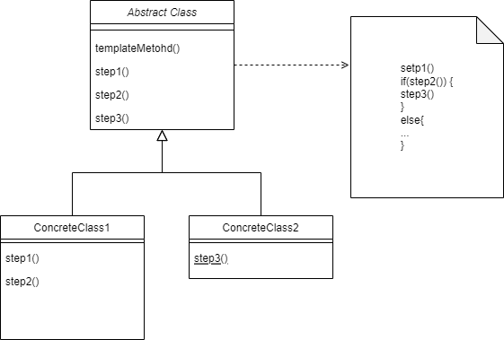

Template-Method Pattern
================

### 설명

부모 클래스에서 알고리즘의 골격을 정의하지만, 해당 알고리즘의 구조를 변경하지 않고 자식 클래스들이 
알고리즘의 특정 단계들을 오버라이드 할 수 있도록 하는 행동 디자인 패턴 

> 어떤 작업을 처리하는 일부분을 서브 클래스로 캡슐화하여, 전체 일을 수행하는 구조는 바꾸지 않으면서 특정 단계의 수행하는 내역을 바꾸는 패턴

**즉 전체적으로는 동일하면서 부분적으로 다른 구문으로 구성된 메서드의 코드 중복을 최소화하는 디자인 패턴**이다.

### 특징

- 클라이언트들이 알고리즘의 특정 단계들만 확장할 수 있도록 하고 싶을때, 그러나 전체 알고리즘이나 구조는 확장하지 못하도록 하려고 할때 사용!
    - 모놀리식 알고리즘을 일련의 개별단계들로 전환할 수 있도록 한다. 따라서 부모 클래스에서 정의된 구조를 그대로 유지하면서, 자식 클래스들에 의해 쉽게 확장될 수 있다.

- 거의 같은 알고리즘들을 포함하는 여러 클래스가 있는 경우, 알고리즘이 변경되면, 모든 클래스를 수정해야 하는 경우 사용하면 좋다.
    - 위와 같은 케이스를 템플릿 메서드 패턴을 적용하면 유사한 구현들이 있는 단계는 부모 클래스로 끌어 올려 코드의 중복을 제거 할 수 있다. 각각의 코드가 다른 부분만 자식 클래스에 남겨 둔다.

### 구현 방법
1. 대상 알고리즘을 분석하여, 여러 단계로 나눌 수 있는 지, 각 단계별로 자식클래스에 공통인 부분과 고유한 부분을 확인한다.  

2. 추상 기초 클래스를 만들고 알고리즘의 단계들을 표현하는 템플릿 메서드와 추상 메서드들의 집합을 선언한다. 해당 단계들을 실행하여 템플릿 메서드에서 알고리즘의 구조의 윤곽을 잡고, 자식들이 오버라이드 하지 못하도록 할 공통 템플릿 메서드는 final 을 붙이는 것을 고려한다.

3. 모든 메서드가 추상 메서드여도 괜찮지만, 일부 공통 메서드는 구현할 경우, 자식 클래스는 공통부분의 추가 구현을 하지 않아도 된다는 것을 명시적으로 표현할 수 있다.

4. 각 중요한 단계들 사이에 훅들을 추가한다.

5. 추상 클래스를 상속 받아 구현하는 자식 클래스를 생성한다. 모든 추상 단계를 필수 적으로 구현하고, 일부 선택 단계는 오버라이드 하여 구현을 선택적으로 할 수 있다.

### 구조

### 예시

#### 문제상황
> 회사문서들을 분석하는 데이터 마이닝 앱을 만든다고 할때, 다양한 형식(pdf, xml, doc ...)의 문서들을 일관된
> 일관된 형식의 데이터로 추출하려고 한다.
> 앱의 첫번째 버전은 doc파일만 허용하여 동작하고, 두번째는 csv 파일을 지원하도록 수정하였다.
> 다음달 pdf 파일 데이터 추출 기능을 추가하려고 한다.
> 각각의 역활을 수행하는 코드들은 읽어오는 부분은 다르지만, 처리 및 분석하는 부분의 코드는 중복되고 있다.
> 이때 알고리즘의 구조 (로드 -> 처리 -> 분석) 은 그대로 유지하면 코드의 중복을 제거하려 한다.
> 또한 기존 소스에서 조건문으로 읽어오는 파일 형식에 따른 처리가 분기 되었으나 이 부분을 
> 공통 인터페이스와 추상 클래스를 통해 조건문을 제거하고, 처리 객체 메서드 호출시 다형성을 활용해 코드를 정리하려고 한다.

#### 해결 방안
템플릿 메서드 패턴은 알고리즘을 일련의 **단계로 나누고, 이를 메서드들로 변환한 뒤 단일 템플릿 메서드 내부에서 일련의 호출들을 넣도록 제안한다.**
각 단계들은 abstract 혹은 default 메서드이다. 알고리즘을 사용하기 위해 클라이언트는 자식 클래스가 모든 추상 단계를 구현하며 필요에 따라 선택적으로 일부메서드를 오버라이드하도록 한다.

>위 문제 상황에서 파일로 부터 데이터를 읽어서 분석, 처리하는 부분을 일련의 추상 클래스 혹은 인터페이스로 작성한 뒤,
> pdf,csv,doc 등 형식에 따라 읽어오는 부분과 데이터를 추출하는 부분을 선택적으로 구현하도록 할 수 있다.
> 추상 클래스의 abstract로 선언된 부분은 자식 클래스로 하여금, 구현을 강제하고 (각 파일에 맞게 데이터를 읽어온다.)
> 중복 코드를 피하기 위해 final 혹은 default로 구현된 부분은 default일 경우 필요에 따라 선택적으로 오버라이드 하지만 final 로 선언된 부분은 
> 공통 파트로 구현을 제한한 것이므로 구현하지 않고, 구현된 부분을 사용한다. 
> 따라서 크게 두가지 부분인다.
- 모든 자식클래스는 추상 메서드를 구현해야 한다.
- 선택적 메서드에는 어떤 디폴트 구현이 있지만, 필요에 따라 무시하고 오버라이드하여 구현할 수 있다.

### 장/단점

#### 장점
- 클라이언트들이 대규모 알고리즘의 특정 부분만 오버라이드 하여 구현 하므로, 알고리즘의 다른 부분의 변경에 따른 영향이 적다.
- 중복 코드를 모두 부모 클래스로 가져 올 수 있다.

#### 단점
- 일부 클라이언트들은 알고리즘의 제공된 골격에 의해 제한될 수 있다. 
- 자식 클래스를 통해 디폴트 구현을 역제하여 리스코프 치환 원칙(LSP - 부모-자식 관계에서 자식 객체가 부모 객체를 완전히 대체할 수 있어야 한다.)을 위반할 수 있다.
- 템플릿 메서드들의 단계가 많을 경우 유지보수 비용이 클 수 있다.

#### 예시
- not yet
- 